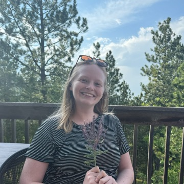

```{=html}
<style>
.two-column {
  display: flex;
  align-items: flex-start;
  gap: 30px;
  text-align: left;
  border: none;
  box-shadow: none;
  background: none;
}

.two-column .image-column {
  flex: 0 0 30%;
}

.two-column .image-column img {
  width: 100%;
  height: auto;
}

.two-column .caption {
  margin-top: 8px;
  text-align: left;
  font-size: 0.9em;
  border: none;
  box-shadow: none;
  background: none;
  overflow-wrap: normal;
  word-break: normal;
}

.two-column .text {
  flex: 1;
  border: none !important;
  box-shadow: none !important;
  background: none !important;

  /* Keep words intact */
  word-break: keep-all !important;
  overflow-wrap: normal !important;
  hyphens: none !important;
}
</style>
```

```{r setup, include=FALSE}
knitr::opts_chunk$set(echo = TRUE)
```

:::::: two-column
:::: image-column
```{r, echo=FALSE}
      
```

::: caption
:::
::::

::: text
I'm a biochemical engineer working at the interface of experimental biology, bioprocess engineering, and data science. My background spans strain and fermentation process development, multi-omics analysis, and statistical modeling, with experience across academic (UT Austin, MIT), pharma (BMS, Takeda), and startup (BioReNuva) environments.

I'm currently looking for a full-time position in the SF area starting Fall or Winter 2026. 

[Email](mailto:sarahmcoleman.phd%40gmail.com)\
[GitHub](https://github.com/sarahmcoleman)\
[Google Scholar](https://scholar.google.com/citations?user=gtfao50AAAAJ)\
[LinkedIn](https://linkedin.com/in/sarah-m-coleman-b96178127)\
[ORCID](https://orcid.org/0000-0002-0243-9776)
:::
::::::
