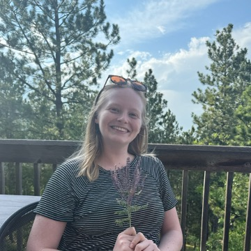

```{=html}
<style>
/* ===== Homepage layout ===== */

.two-column {
  display: flex;
  align-items: flex-start;
  gap: 34px;
  text-align: left;
  border: none;
  box-shadow: none;
  background: none;
}

.two-column .image-column {
  flex: 0 0 30%;
}

.two-column .image-column img {
  width: 100%;
  height: auto;
  border-radius: 6px;
  box-shadow: 0 1px 4px rgba(0, 0, 0, 0.16);
}

.two-column .caption {
  margin-top: 8px;
  text-align: left;
  font-size: 0.9em;
  border: none;
  box-shadow: none;
  background: none;
  overflow-wrap: normal;
  word-break: normal;
}

.two-column .text {
  flex: 1;
  border: none !important;
  box-shadow: none !important;
  background: none !important;

  /* Keep words intact */
  word-break: keep-all !important;
  overflow-wrap: normal !important;
  hyphens: none !important;
}

.two-column .text p {
  line-height: 1.6;
}

.tagline {
  margin: -4px 0 24px 0;
  font-size: 1em;
  line-height: 1.35;
  color: #4a4a4a;
}

/* ===== Links row ===== */

.linkrow {
  display: flex;
  flex-wrap: wrap;
  align-items: center;
  gap: 10px 16px;
  margin-top: 24px;
  padding-top: 18px;
  border-top: 1px solid #e4e4e4;
}

.linkrow a {
  color: #1f4e79;
}

.linkrow a:not(.resume-btn):hover,
.linkrow a:not(.resume-btn):focus {
  color: #173c5e;
}

.linkrow a.resume-btn {
  padding: 7px 17px;
  background: #1f4e79;
  color: #ffffff !important;
  border-radius: 4px;
  font-weight: 600;
  text-decoration: none;
}

.linkrow a.resume-btn:hover,
.linkrow a.resume-btn:focus {
  background: #173c5e;
  text-decoration: none;
}

/* ===== Small screens ===== */

@media (max-width: 700px) {
  .tagline {
    font-size: 0.92em;
  }

  .two-column {
    display: block;
  }

  .two-column .image-column {
    width: 62%;
    max-width: 260px;
    margin: 0 0 22px 0;
  }

  .linkrow a.resume-btn {
    flex: 1 0 100%;
    text-align: center;
  }
}
</style>
```

```{r setup, include=FALSE}
knitr::opts_chunk$set(echo = TRUE)
```

```{=html}
<p class="tagline">Bioprocess Development Engineer | Fermentation, synthetic biology, statistics and bioinformatics </p>
```

:::::: two-column
:::: image-column
```{r, echo=FALSE, fig.alt="Sarah M. Coleman"}
      
```

::: caption
:::
::::

::: text
My background spans upstream process development, synthetic biology, and metabolic engineering, coupled with graduate training in statistics (MS) and bioinformatics. I have research experience across biopharma (Bristol Myers Squibb, Takeda), academic (UT Austin, MIT), and startup (BioReNuva) environments. I have worked across bacterial, yeast, and mammalian cell culture.

At BioReNuva I developed the company's first bioreactor fermentation process and the documentation to hand it to manufacturing. My doctoral work in the Alper lab centered on the oleaginous yeast *Yarrowia lipolytica*: I developed Golden Gate based genome editing and promoter library screening, performed adaptive laboratory evolution to raise tolerance to industrial waste streams, and integrated CFD modeling of high-oil-density fermentations.

```{=html}
<div class="linkrow">
  <a class="resume-btn" href="cv.html">Resume</a>
  <a href="mailto:sarahmcoleman.phd@gmail.com">Email</a>
  <a href="https://www.linkedin.com/in/sarah-m-coleman/">LinkedIn</a>
  <a href="https://github.com/sarahmcoleman">GitHub</a>
  <a href="papers.html">Publications</a>
  <a href="https://scholar.google.com/citations?user=gtfao50AAAAJ">Google Scholar</a>
</div>

```
:::
::::::
